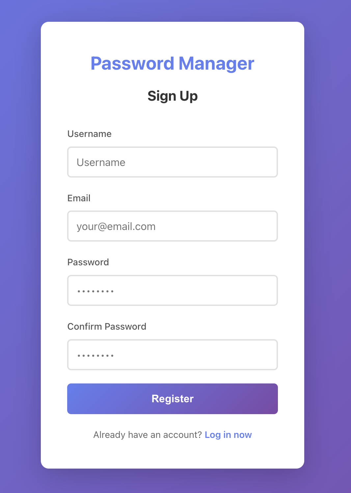
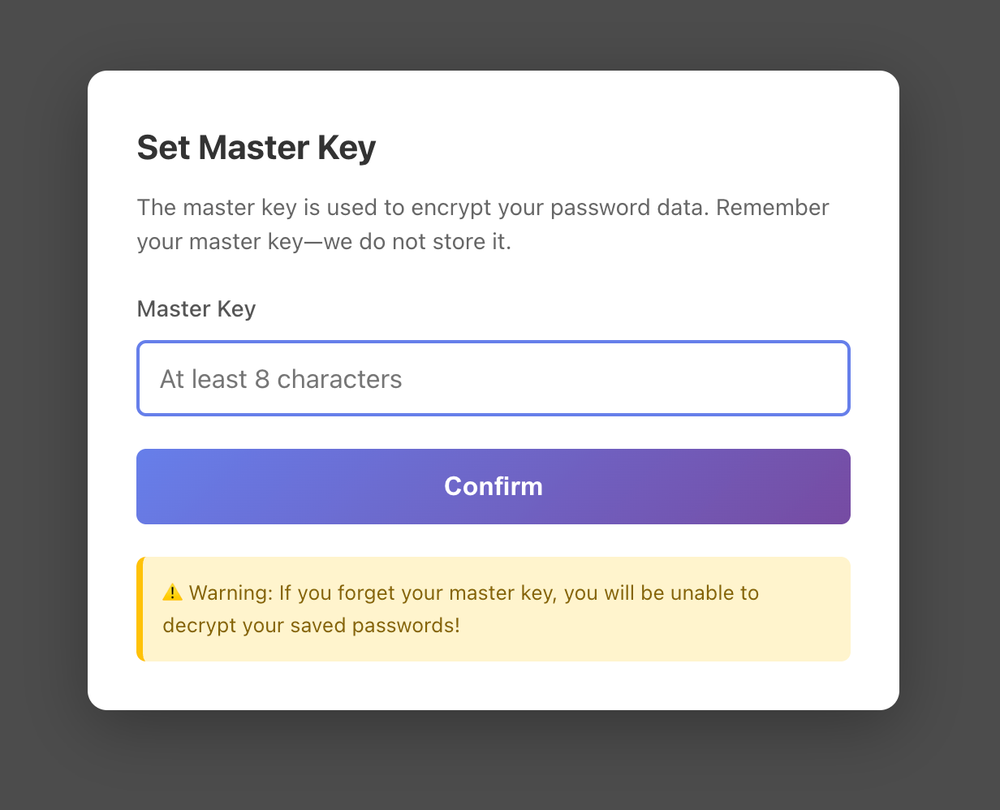
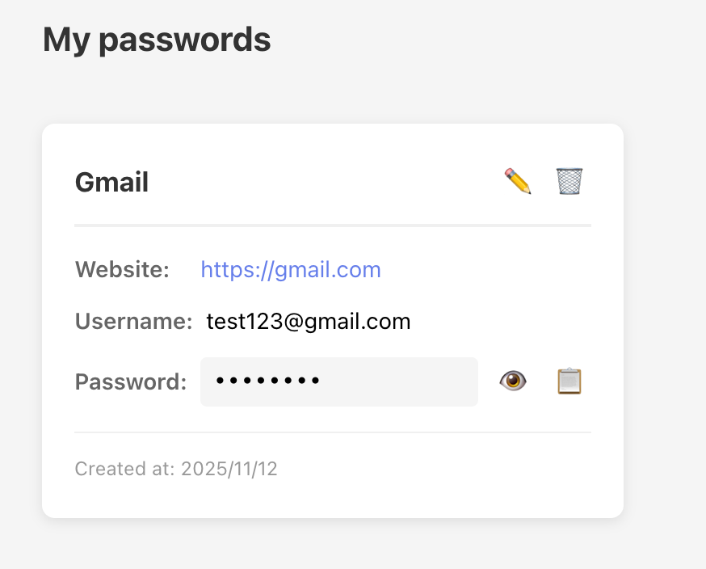

# 🔐 Password Manager

A web-based password management application built using a modern technology stack, providing secure password storage and management capabilities (emphasizing the application of information security technologies).

[](https://nodejs.org/)
[](https://reactjs.org/)
[](https://www.postgresql.org/)
[](LICENSE)

---

## 📖 Project Overview

This is a full-stack password management application designed to help users securely store and manage passwords for various online accounts. The project adopts a frontend-backend separation architecture, implementing user authentication, encrypted password storage, and complete CRUD operations.

**Core Features:**

- 🔒 End-to-end AES-256 encryption
- 🔑 JWT authentication
- 🎲 Strong password generator
- 👥 Multi-user data isolation
- 📱 Responsive UI design

---

## ✨ Features

### Minimum Viable Product (MVP)

- **User Management**
- User Registration
- User Login
- JWT Token Authentication
- Automatic Logout

- **Password Management**
- Add New Password
- View Password List
- Edit Password Information
- Delete Password
- Password Show/Hide Toggle
- One-Click Copy Password to Clipboard

- **Security Features**

  - User Password bcrypt Hash Encryption
  - Password Entries AES-256 Encryption
  - Master Key Management
  - Complete User Data Isolation
  - Automatic Token Refresh Mechanism

- **Support Features**
  - Strong Password Generator (16 characters, includes uppercase/lowercase letters, numbers, symbols)
  - Form Validation
  - Error Notifications
  - Loading Status

---

## 🛠️ Technology Stack

### Front-end Technology

- **Framework**: React 18
- **Build Tool**: Vite 7
- **Routing**: React Router DOM 6
- **HTTP Client**: Axios
- **Encryption Library**: CryptoJS (AES)
- **Styling**: Native CSS

### Back-end Technology

- **Runtime**: Node.js 24.x
- **Framework**: Express.js
- **Database**: PostgreSQL 14.x
- **Authentication**: JSON Web Tokens (JWT)
- **Password Hashing**: bcrypt
- **Environment Variables**: dotenv
- **Cross-Origin**: CORS

### Development Tools

- **Version Control**: Git & GitHub
- **Code Editor**: Visual Studio Code
- **API Testing**: Thunder Client / Postman
- **Package Management**: npm

---

## 📁 Project Structure

```
password-manager/
├── frontend/                 # React frontend application
│   ├── src/
│   │   ├── api/             # API request encapsulation
│   │   │   ├── axios.js
│   │   │   └── passwordApi.js
│   │   ├── components/      # Reusable components
│   │   │   ├── MasterKeyModal.jsx
│   │   │   ├── PasswordCard.jsx
│   │   │   └── PasswordForm.jsx
│   │   ├── context/         # Global state management
│   │   │   ├── AuthContext.jsx
│   │   │   └── MasterKeyContext.jsx
│   │   ├── pages/           # Page Components
│   │   │   ├── Login.jsx
│   │   │   ├── Register.jsx
│   │   │   └── Dashboard.jsx
│   │   ├── styles/          # Style files
│   │   │   ├── Auth.css
│   │   │   └── Dashboard.css
│   │   ├── utils/           # Utility functions
│   │   │   └── crypto.js
│   │   ├── App.jsx
│   │   └── main.jsx
│   ├── package.json
│   └── vite.config.js
│
├── backend/                  # Node.js backend application
│   ├── middleware/
│   │   └── auth.js          # JWT authentication middleware
│   ├── routes/
│   │   ├── auth.js          # User authentication routes
│   │   └── passwords.js     # Password management routes
│   ├── .env                 # Environment variables
│   ├── db.js                # Database connection
│   ├── server.js            # Server entry point
│   └── package.json
│
└── README.md                 # Project documentation
```

---

## 🗄️ Database Design

### users table

```sql
CREATE TABLE users (
    id SERIAL PRIMARY KEY,
    username VARCHAR(50) UNIQUE NOT NULL,
    email VARCHAR(100) UNIQUE NOT NULL,
    password VARCHAR(255) NOT NULL,  -- bcrypt hash
    created_at TIMESTAMP DEFAULT CURRENT_TIMESTAMP
);
```

### passwords table

```sql
CREATE TABLE passwords (
    id SERIAL PRIMARY KEY,
    user_id INTEGER REFERENCES users(id) ON DELETE CASCADE,
    site_name VARCHAR(100) NOT NULL,
    site_url VARCHAR(255),
    username VARCHAR(100),
    encrypted_password TEXT NOT NULL,  -- AES encrypted
    created_at TIMESTAMP DEFAULT CURRENT_TIMESTAMP,
    updated_at TIMESTAMP DEFAULT CURRENT_TIMESTAMP
);
```

---

## 🚀 Installation and Execution

### Prerequisites

- Node.js 20.x or higher
- PostgreSQL 14.x or higher
- npm or yarn

### 1. Clone the project

```bash
git clone https://github.com/zackJin1224/Password-management-system.git
cd password-manager
```

### 2. Backend setup

```bash
cd backend
npm install
```

**Configure Environment Variables:**

Create a `.env` file in the `backend` directory:

```env
# Database Configuration
DB_HOST=localhost
DB_PORT=5432
DB_NAME=password_manager
DB_USER=postgres
DB_PASSWORD=your_database_password        # ⚠️ Replace with your actual password

# JWT secret
JWT_SECRET=your_jwt_secret                # ⚠️ See generation method below

# Server configuration
PORT=3001
```

**Generate JWT secret:**

Use the following command to generate a secure random key:

```bash
node -e “console.log(require(‘crypto’).randomBytes(32).toString(‘hex’))”
```

Copy the output string into `JWT_SECRET`.

**Alternatively, copy the `.env.example` file:**

```bash
cp .env.example .env
# Then edit the .env file with your actual configuration
```

Create database:

```bash
# Connect to PostgreSQL
psql postgres

# Create database
CREATE DATABASE password_manager;

# Switch to database
\c password_manager

# Create users table
CREATE TABLE users (
    id SERIAL PRIMARY KEY,
    username VARCHAR(50) UNIQUE NOT NULL,
    email VARCHAR(100) UNIQUE NOT NULL,
    password VARCHAR(255) NOT NULL,
    created_at TIMESTAMP DEFAULT CURRENT_TIMESTAMP
);

# Create the passwords table
CREATE TABLE passwords (
    id SERIAL PRIMARY KEY,
    user_id INTEGER REFERENCES users(id) ON DELETE CASCADE,
    site_name VARCHAR(100) NOT NULL,
    site_url VARCHAR(255),
    username VARCHAR(100),
    encrypted_password TEXT NOT NULL,
    created_at TIMESTAMP DEFAULT CURRENT_TIMESTAMP,
    updated_at TIMESTAMP DEFAULT CURRENT_TIMESTAMP
);
```

Start the backend server:

```bash
npm run dev
```

The backend will run at `http://localhost:3001`

### 3. Frontend Setup

Open a new terminal:

```bash
cd frontend
npm install
```

Start the frontend development server:

```bash
npm run dev
```

The frontend will run at `http://localhost:3000`

---

## 📱 User Guide

### 1. Register an Account



- Visit `http://localhost:3000`
- Click “Register Now”
- Enter your username, email address, and password
- Submit registration

2. Login


- Log in using your registered email and password
- After successful login, you will be automatically redirected to the Dashboard

### 3. Set the Master Key



- The master key setup window will appear upon first login
- Enter a strong key (minimum 8 characters)
- **⚠️ Important**: Memorize your master key—the system does not store it!

4. Add Password


- Click the “➕ Add Password” button
- Fill in website details:
  - Website Name (required)
  - Website URL (optional)
  - Username/Email (optional)
  - Password: Manually enter or click “Generate”
- Click “Save”

### 5. Manage Passwords



- **View Password**: Tap the 👁️ icon to show/hide the password
- **Copy Password**: Tap the 📋 icon to copy to clipboard
- **Edit Password**: Tap the ✏️ icon to modify details
- **Delete Password**: Tap the 🗑️ icon to remove password

---

## 🔒 Security Implementation

### 1. User Authentication Security

- **Password Hashing**: User login passwords are encrypted and stored using bcrypt (salted hashing)
- **JWT Token**: Stateless authentication with a 7-day token validity period
- **Token Validation**: Middleware automatically validates each protected request
- **Authorization Header**: Standard Bearer Token authentication method

### 2. Data Encryption

- **AES-256 Encryption**: All password entries are encrypted using AES-256 on the frontend before being sent to the server
- **Master Key Management**: Stored exclusively in the user's browser sessionStorage; never accessed by the server
- **End-to-End Encryption**: Even if the database is compromised, passwords remain indecipherable without the master key
- **Zero-Knowledge Architecture**: The server stores only encrypted data, never accessing users' plaintext passwords

### 3. Frontend Security

- **Request Interceptor**: Axios automatically adds a JWT token to every request header
- **Response Interceptor**: 401 errors automatically invalidate the token and redirect to the login page
- **Route Protection**: PrivateRoute components secure pages requiring authentication
- **Public Route Protection**: PublicRoute prevents logged-in users from accessing login/signup pages

### 4. Backend Security

- **SQL Parameterized Queries**: Use prepared statements to prevent SQL injection attacks
- **User Data Isolation**: Validate user_id in every API request to ensure users access only their own data
- **CORS Configuration**: Restrict cross-origin access, permitting only specified origins
- **Environment Variables**: Do not hardcode sensitive information like database passwords or JWT keys

### 5. Session Management

- **localStorage**: Stores JWT Token (maintains login state, persists after browser closure)
- **sessionStorage**: Stores master key (automatically clears upon tab closure for enhanced security)
- **Separate Storage**: Token and master key stored independently for dual protection

---

## 🏗️ Architecture Design

### System Architecture Diagram

```
┌─────────────────────────────────────────────────────────┐
│                   Browser                               │
│  ┌───────────────────────────────────────────────────┐  │
│  │  • React Frontend (Port 3000)                     │  │
│  │  • User Interface (UI Components)                 │  │
│  │  • State Management (Context API)                 │  │
│  │  • AES Encryption/Decryption (CryptoJS)           │  │
│  │  • HTTP Requests (Axios)                          │  │
│  └───────────────────────────────────────────────────┘  │
└─────────────────────────────────────────────────────────┘
                          │
                          │ HTTP/HTTPS
                          │ REST API
                          ↓
┌─────────────────────────────────────────────────────────┐
│            Express Backend (Port 3001)                  │
│  ┌───────────────────────────────────────────────────┐  │
│  │  • Routing Handling (Routes)                      │  │
│  │  • JWT Authentication Middleware (Middleware)     │  │
│  │  • Business Logic Processing (Controllers)        │  │
│  │  • Database Operations (pg)                       │  │
│  └───────────────────────────────────────────────────┘  │
└─────────────────────────────────────────────────────────┘
                          │
                          │ SQL Queries
                          ↓
┌─────────────────────────────────────────────────────────┐
│  • PostgreSQL Database (Port 5432)                      │
│  • users table (user information)                       │
│  • passwords table (encrypted password entries)         │
└─────────────────────────────────────────────────────────┘
```

---

### Data Flow

#### Registration/Login Process

```
User input → Frontend validation → HTTP POST → Backend validation →
bcrypt encryption → Store in database → Generate JWT → Return to frontend →
Save to localStorage
```

#### Password Encryption and Storage Process

```
User enters password → Frontend AES encryption (master key) → HTTP POST →
Backend receives ciphertext → Stored in database (server cannot see plaintext)
```

#### Password Decryption and Retrieval Process

```
HTTP GET → Backend returns ciphertext list → Frontend receives →
User clicks to view → AES decryption (master key) → Display plaintext
```

---

## 🎯 API Documentation

### Authentication

#### Registration

```http
POST /api/auth/register
Content-Type: application/json

Request Body:
{
  “username”: “testuser”,
  “email”: “test@example.com”,
  “password”: “password123”
}

Response:
{
  “message”: “Registration successful”
}
```

#### Login

```http
POST /api/auth/login
Content-Type: application/json

Request Body:
{
  “email”: “test@example.com”,
  “password”: “password123”
}

Response:
{
  “token”: “eyJhbGciOiJIUzI1NiIsInR5cCI6IkpXVCJ9...”,
  “user”: {
    “id”: 1,
    “username”: “testuser”,
    “email”: “test@example.com”
  }
}
```

### Password Management（Requires JWT Token）

#### Retrieve All Passwords

```http
GET /api/passwords
Authorization: Bearer

Response:
{
  "passwords": [
    {
      "id": 1,
      "user_id": 1,
      "site_name": "Gmail",
      "site_url": "https://gmail.com",
      "username": "user@gmail.com",
      "encrypted_password": "U2FsdGVkX1...",
      "created_at": "2025-11-10T...",
      "updated_at": "2025-11-10T..."
    }
  ]
}
```

#### Add Password

```http
POST /api/passwords
Authorization: Bearer
Content-Type: application/json

Request Body:
{
  “site_name”: “Gmail”,
  “site_url”: “https://gmail.com”,
  “username”: “user@gmail.com”,
  “encrypted_password”: “U2FsdGVkX1...”
}

Response:
{
  “message”: “Password added successfully”,
  “password”: { ... }
}
```

#### Update Password

```http
PUT /api/passwords/:id
Authorization: Bearer
Content-Type: application/json

Request Body:
{
  “site_name”: “Gmail”,
  “site_url”: “https://gmail.com”,
  “username”: “newuser@gmail.com”,
  “encrypted_password”: “U2FsdGVkX1...”
}

Response:
{
  “message”: “Password updated successfully”,
  “password”: { ... }
}
```

Delete Password

```http
DELETE /api/passwords/:id
Authorization: Bearer

Response:
{
  “message”: “Password deleted successfully”
}
```

---

## 🧪 Testing

### Manual Test Checklist

- [✅] User registration functionality
- [✅] User login functionality
- [✅] Password addition functionality
- [✅] Password viewing (decryption) functionality
- [✅] Password editing functionality
- [✅] Password deletion functionality
- [✅] Password generator functionality
- [✅] Copy to clipboard functionality
- [✅] Error when master key fails to decrypt
- [✅] Login persists after page refresh
- [✅] Logout functionality
- [✅] Multi-user data isolation

## 🤝 Contributing

We welcome issues and pull requests!

1. Fork this project
2. Create a feature branch (`git checkout -b feature/AmazingFeature`)
3. Commit your changes (`git commit -m ‘Add some AmazingFeature’`)
4. Push to the branch (`git push origin feature/AmazingFeature`)
5. Open a pull request

---

## 📄 License

MIT License

---

## 👨‍💻 Author

**Zach**

- GitHub: [@zachJin1224](https://github.com/zachJin1224)
- University: University of Pittsburgh

---

## 🙏 Acknowledgments

Special thanks to the following open-source projects:

- [React](https://reactjs.org/) - Powerful frontend framework
- [Vite](https://vitejs.dev/) - Fast build tool
- [Express](https://expressjs.com/) - Minimalist backend framework
- [PostgreSQL](https://www.postgresql.org/) - A reliable database
- [CryptoJS](https://cryptojs.gitbook.io/) - A cryptography library
- [Axios](https://axios-http.com/) - An HTTP client

---
